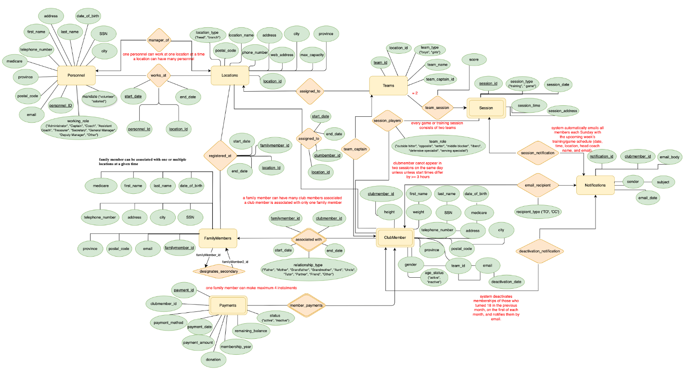
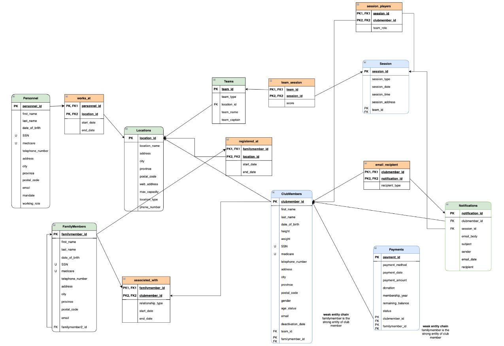
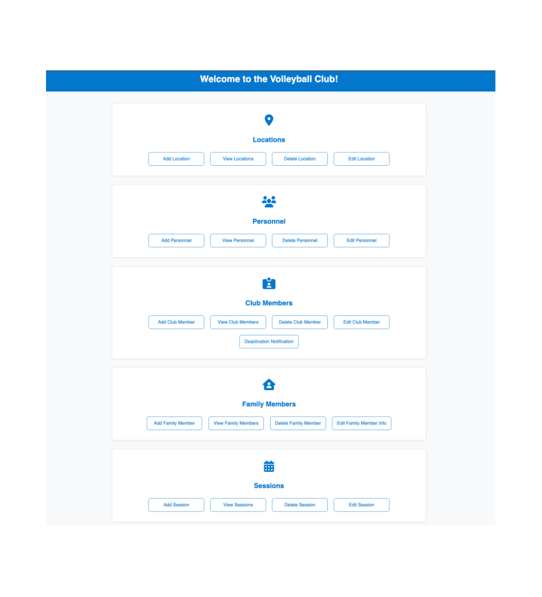

# Volleyball Club Management System 

## Overview

This project was developed as part of a database systems course. The objective was to design and implement a complete database solution for managing the operations of a volleyball club.

The project includes the entire database development lifecycle, from conceptual design to implementation and a web-based user interface.

## Project Components

### 1. Entity-Relationship (ER) Diagram

The project began with the analysis of the club's requirements and the creation of an ER diagram to model entities, attributes, and relationships.

Examples of entities include:

- Club Members
- Family Members
- Personnel
- Teams
- Sessions
- Locations
- Payments

### 2. Relational Database Design

The ER model was transformed into a relational schema with:

- Primary Keys
- Foreign Keys
- Relationship Constraints
- Data Integrity Rules

### 3. Database Implementation

The database was implemented using SQL and includes:

- Table creation scripts
- Constraints
- Data insertion scripts
- Sample records

### 4. SQL Queries and Reports
A collection of SQL queries was developed to support club operations, including:

- Member information retrieval
- Team assignments
- Session participation reports
- Payment tracking
- Location summaries
- Activity reports

### 5. Web-Based User Interface

A web application was developed using PHP, HTML, and CSS to allow users to interact with the database.

Features include (CRUD operations):

- Create records
- View records
- Update records
- Delete records

## Technologies Used

- SQL
- MySQL / MariaDB
- PHP
- HTML
- CSS

## Learning Outcomes

Through this project I gained experience in:

- Database modeling and normalization
- ER diagram design
- Relational schema development
- SQL query writing
- Database constraints and relationships
- PHP database connectivity
- CRUD application development
- Front-end and back-end integration

## Author

Andrea Delgado
Graduate Diploma in Computer Science
Concordia University

To start php:
 cd "/Users/andreadelgado/Documents/GITHUB PROJECTS/Volleyball Database"     
andreadelgado@MacBookAir Volleyball Database % php -S localhost:8000
[Tue Jun 23 06:15:05 2026] PHP 8.2.4 Development Server (http://localhost:8000) started

http://localhost:8000/main.php